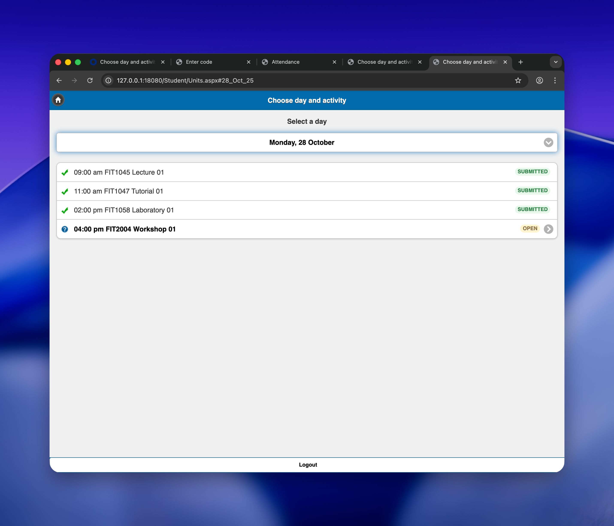

# aPlus+ Mock Portal

A lightweight mock server that emulates the Monash University attendance portal for testing and development purposes. This server replicates the key functionality of the real attendance system, allowing developers to test attendance automation tools without affecting production systems.

<p align="center">
  
  <br />
  <em>Demo image</em>
</p>

## Features

- **Authentic UI**: Pixel-perfect recreation of the Monash attendance portal interface using jQuery Mobile
- **Complete Navigation Flow**: Home → Units → Entry pages with proper state management
- **Session Management**: Mock student sessions with configurable attendance codes
- **Status Tracking**: Support for pending, submitted, and locked attendance states
- **Data Persistence**: JSON-based mock data that can be easily modified
- **Reset Functionality**: API endpoint to reset all attendance states for testing
- **Course Information**: `/AttendanceInfo.aspx` endpoint for enrolled course data extraction

## Architecture

The mock portal is built with:
- **Backend**: Python with aiohttp web framework
- **Frontend**: jQuery Mobile for authentic mobile-first UI
- **Data**: JSON-based mock attendance records
- **Templates**: Server-side HTML rendering with proper escaping

## Quick Start

### Prerequisites

- Python 3.8+
- pip

### Installation

1. Clone the repository:
```bash
git clone https://github.com/your-username/aplus-mock-portal.git
cd aplus-mock-portal
```

2. Install dependencies:
```bash
pip install -r requirements.txt
```

3. Start the server:
```bash
python -m src.server --host 0.0.0.0 --port 8081
```

4. Access the portal at: http://localhost:8081/student/

### Configuration

The server can be configured via command line arguments or environment variables:

#### Command Line Arguments
```bash
python -m src.server --help
```

Options:
- `--host`: Server host (default: 127.0.0.1)
- `--port`: Server port (default: 8080)
- `--data`: Path to JSON data file (default: mock_units.json)

#### Environment Variables
Create a `.env` file:
```bash
PORTAL_URL=http://localhost:8081
WEEK_NUMBER=12
CODES_DB_PATH=./data
BROWSER=chromium
BROWSER_CHANNEL=chrome
HEADLESS=0
STORAGE_STATE=storage_state.json
```

## API Endpoints

### Student Portal Routes
- `GET /student/` - Main homepage
- `GET /student/Units.aspx` - Course selection page
- `GET /student/Entry.aspx?s={session_id}&d={day_anchor}` - Attendance code entry
- `POST /student/Entry.aspx` - Submit attendance code
- `GET /student/AttendanceInfo.aspx` - Course information page
- `GET /student/Default.aspx` - Alternative homepage

### Admin Routes
- `POST /mock/reset` - Reset all attendance data to initial state

### Static Assets
- `/student/jq/` - jQuery library files
- `/student/jqm/` - jQuery Mobile assets
- `/student/img/` - UI icons and images

## Data Structure

The mock data is stored in `mock_units.json` with the following structure:

```json
{
  "days": [
    {
      "anchor": "28_Oct_25",
      "label": "Monday, 28 October",
      "entries": [
        {
          "session_id": "564001",
          "course_code": "FIT1045",
          "slot_label": "Lecture 01",
          "time_label": "09:00 am",
          "status": "pending",
          "code": "M8YHB"
        }
      ]
    }
  ]
}
```

### Status Values
- `pending`: Attendance code can be submitted
- `submitted`: Code already submitted successfully
- `locked`: Session is closed, no submissions allowed

## Usage Examples

### Testing Attendance Submission

1. Navigate to the portal: http://localhost:8081/student/
2. Click "Enter attendance code"
3. Select a day and course
4. Enter the attendance code (found in `mock_units.json`)
5. Submit and verify status change

### API Integration Testing

```python
import requests

# Get course information
response = requests.get('http://localhost:8081/student/AttendanceInfo.aspx')
courses = response.text  # Parse HTML for course codes

# Submit attendance code
form_data = {
    'ctl00$ContentPlaceHolder1$txtAttendanceCode': 'M8YHB'
}
response = requests.post(
    'http://localhost:8081/student/Entry.aspx?s=564001&d=28_Oct_25',
    data=form_data
)
```

### Reset Testing State

```bash
curl -X POST http://localhost:8081/mock/reset
```

## Development

### Project Structure
```
aplus-mock-portal/
├── src/
│   ├── __init__.py
│   ├── server.py          # Main server and routing
│   ├── templates.py       # HTML template rendering
│   └── data_loader.py     # JSON data handling
├── static/                # Static web assets
│   ├── jq/               # jQuery library
│   ├── jqm/              # jQuery Mobile assets
│   └── img/              # UI icons
├── mock_units.json        # Mock attendance data
├── requirements.txt       # Python dependencies
└── README.md             # This file
```

### Key Components

#### Server (`src/server.py`)
- aiohttp web application setup
- Route handlers for all endpoints
- Static file serving
- URL normalization for case-insensitive paths

#### Templates (`src/templates.py`)
- jQuery Mobile HTML generation
- Proper HTML escaping and security
- Responsive mobile-first design
- Status indicators and form handling

#### Data Loader (`src/data_loader.py`)
- JSON data parsing and validation
- Session lookup and management
- Day grouping and organization

### Customization

#### Adding New Courses
Edit `mock_units.json` to add new course entries:

```json
{
  "session_id": "564999",
  "course_code": "FIT9999",
  "slot_label": "New Session",
  "time_label": "10:00 am",
  "status": "pending",
  "code": "NEWCODE"
}
```

#### Modifying UI Styling
The templates use jQuery Mobile themes. Customize in `src/templates.py`:
- Update CSS classes for different themes
- Modify HTML structure for layout changes
- Add custom CSS in the `<style>` sections

## Troubleshooting

### Common Issues

**Server won't start**
- Check if port is already in use: `lsof -ti:8081`
- Kill existing processes: `pkill -f "server.py"`

**Pages not loading correctly**
- Clear browser cache and reload
- Check browser console for JavaScript errors
- Verify all static assets are accessible

**jQuery Mobile conflicts**
- Ensure `data-ajax="false"` is set on navigation buttons
- Check for JavaScript errors in browser console
- Verify jQuery Mobile CSS/JS files are loaded

**Data not persisting**
- Changes to JSON data require server restart
- Use `/mock/reset` endpoint to reload data
- Check file permissions on `mock_units.json`

## Testing

The mock portal is designed to support comprehensive testing scenarios:

1. **Manual Testing**: Use the web interface to test user workflows
2. **API Testing**: Direct HTTP requests to endpoints
3. **Automation Testing**: Selenium/Playwright integration
4. **Load Testing**: Multiple concurrent sessions

## Security Notes

This is a **mock server for development/testing only**:
- No authentication or authorization
- Hardcoded attendance codes in JSON
- Not suitable for production use
- Static mock data only

## License

This project is licensed under the MIT License. In practical terms this means:
- You may use, copy, modify, merge, publish, distribute, sublicense, and/or sell copies of the software.
- You must include the original copyright and license notice in any substantial portions of the software.
- The software is provided “as is” without warranties; the authors are not liable for any claims or damages arising from its use.

See `LICENSE` for the full legal text.

## Contributing

1. Fork the repository
2. Create a feature branch
3. Make your changes
4. Test thoroughly
5. Submit a pull request

## Support

For issues and questions:
- Create an issue on GitHub
- Check the troubleshooting section
- Review the API documentation
